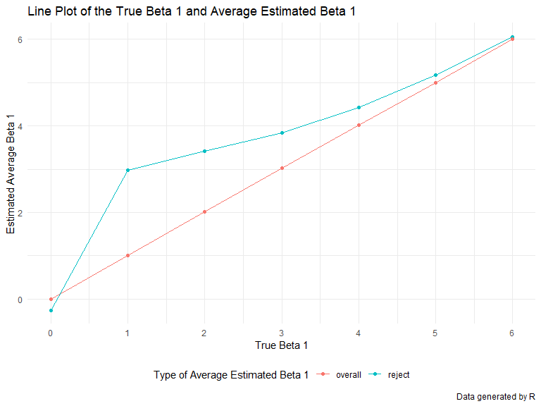

p8105\_hw5\_jt3174
================
Jingyi
11/6/2019

# Problem 1

``` r
# load data as copied from Jeff
iris_with_missing = iris %>% 
  map_df(~replace(.x, sample(1:150, 20), NA)) %>%
  mutate(Species = as.character(Species))
```

``` r
# write a function that fill all missing numeric variables with the mean of non-missing values and all missing categorical variables with virginica

filling = function(column) {
  # make sure the argument is a vector, and if not, stop
  if (!is.vector(column)) {
    stop("Argument should be a vector.")
  }
  # to distinguish numeric variable 
  if (is.numeric(column)) {
    # to make sure we have all orginal data in the output
    column = column %>% 
    # to replace all missing data with the mean of what are not missing in the vector argument
    replace_na(mean(column[!is.na(column)])) 
  }
  # for all other left variables, dintinguish whether this is a categorical variable
  else if (is.character(column)) {
    # make sure we have all original data in the output
    column = column %>% 
    # to replace all missing data with virginica
    str_replace_na("virginica") 
  }
  
}

# use map to iterate over each variable of the dataframe iris_with_missing with filling function that I just wrote above and return a dataframe called iris_filled
iris_filled = map_df(iris_with_missing, filling)

iris_filled
```

    ## # A tibble: 150 x 5
    ##    Sepal.Length Sepal.Width Petal.Length Petal.Width Species  
    ##           <dbl>       <dbl>        <dbl>       <dbl> <chr>    
    ##  1         5.1          3.5          1.4         0.2 virginica
    ##  2         4.9          3            1.4         0.2 setosa   
    ##  3         4.7          3.2          1.3         0.2 setosa   
    ##  4         4.6          3.1          1.5         0.2 setosa   
    ##  5         5            3.6          1.4         0.2 setosa   
    ##  6         5.4          3.9          1.7         0.4 setosa   
    ##  7         5.84         3.4          1.4         0.3 setosa   
    ##  8         5            3.4          1.5         0.2 setosa   
    ##  9         4.4          2.9          1.4         0.2 setosa   
    ## 10         4.9          3.1          1.5         0.1 setosa   
    ## # ... with 140 more rows

# Problem 2

``` r
# vector for pathes of files
path = list.files(path = "./data/", full.names = TRUE) %>% 
  # make this vector a dataframe
  as.data.frame() %>% 
  # give the data a name "file_id"
  rename("file_id" = ".") %>% 
  # make the fild_id a character instead of a factor
  mutate(file_id = as.character(file_id))

# create a list (here would be nested) that stores all data in this study
arm_study_nest = path %>% 
  # add a column called data for each subject
  mutate("data" = purrr::map(.x = pull(., file_id), read_csv))

# tidy data
arm_study = arm_study_nest %>% 
  # get rid of the same ./data/ in the beginning and .csv in the end
  mutate(file_id = str_extract(file_id, "[conexp]{3}_[0-9]{2}")) %>% 
  # unnest the data
  unnest() %>% 
  # to get two columns: subject ID and arm
  separate(file_id, into = c("arm", "subject_id"), sep = "_") %>% 
  # tidy weekly observation
  pivot_longer(
    # for columns week_1 to week_8
    cols = week_1:week_8,
    # put the variable names "week_1" etc. to a new column called week
    names_to = "week",
    # put the values of old weekly observation data to a new column called "weekly_observation"
    values_to = "weekly_observation",
    # get rid of the predix of week_ in the week column
    names_prefix = "week_"
  ) %>% 
  # make subject_id a factor
  mutate(subject_id = as.factor(subject_id),
         arm = as.factor(arm)) %>% 
  # reorder the variables
  select(subject_id, arm, everything())

arm_study
```

    ## # A tibble: 160 x 4
    ##    subject_id arm   week  weekly_observation
    ##    <fct>      <fct> <chr>              <dbl>
    ##  1 01         con   1                   0.2 
    ##  2 01         con   2                  -1.31
    ##  3 01         con   3                   0.66
    ##  4 01         con   4                   1.96
    ##  5 01         con   5                   0.23
    ##  6 01         con   6                   1.09
    ##  7 01         con   7                   0.05
    ##  8 01         con   8                   1.94
    ##  9 02         con   1                   1.13
    ## 10 02         con   2                  -0.88
    ## # ... with 150 more rows

``` r
arm_study %>% 
  # x-axis is week, y-axis is the weekly observation and color by subject_id to show for each subject the weekly observation over time.
  ggplot(aes(x = week, y = weekly_observation, group = subject_id)) +
  # spaghetti plot, divide the group by arm to make sure that we have con_1 and exp_1 since they both have the same subject ID
  geom_line(aes(color = subject_id)) +
  # separate control group from experimental group
  facet_grid( . ~ arm, 
              # label each facet plot more explicitly
             labeller = labeller(arm = c('con' = "Control Group", 'exp' = "Experimental Group"))) +
  # label the subject_id more explicity
  scale_color_discrete("Subject ID") +
  # give nice labels and captions to our plot
  labs(title = "Spaghetti Plot for Arm Study Over Time in Different Groups",
       x = "Week",
       y = "Weekly Obeservation",
       caption = "Data provided by Jeff"
  )
```


Comment: According to the plot above, we can see that the starting week
observation between two groups are roughly the same, but as the time
proceeded, we can see that the experimental group’s weekly observation
started to go up while the control group are roughly staying at the same
places where they started.

# Problem 3

``` r
# function for doing regression simulation and set parameters mentioned
sim_regression = function(n = 30, beta0 = 2, beta1 = 0) {
  
  # simulation dataframe
  sim_data = tibble(
    # x randomly drawn a sample size of n and from N(0,1)
    x = rnorm(n, mean = 1, sd = 1),
    # the linear regression model, and the error term is randomly drawn from a normal distribution with mean of 0 and var of 50 with sample size of 30
    y = beta0 + beta1 * x + rnorm(n, mean = 0, sd = sqrt(50))
  )
  
  # do the linear regression
  ls_fit = lm(y ~ x, data = sim_data)
  
  # take the values of linear regression coefficients and p-values
  ls_with_pvalue = broom::tidy(ls_fit)
  
  # create a dataframe with two variables: beta1_hat and its p-values
  tibble(
    beta1_hat = ls_with_pvalue[[2, "estimate"]],
    p_value = ls_with_pvalue[[2, "p.value"]]
  )
}

# create a dataframe called simulation and has one variable called beta1 that renders from 0 to 6
simulation = tibble(beta1 = 0:6) %>% 
  # add a beta1_hat column and for each beta1, we run 100 times of simulated regression, hence we have a list within a list and a list
  mutate(beta1_hat = map(.x = beta1, ~rerun(10000, sim_regression(beta1 = .x)))) %>% 
  # hence, we need to unnest two times to have a human reader friendly dataframe
  unnest() %>% 
  unnest()
```

``` r
# create a dataframe that is suitable for the plot
simulation_plot_power = simulation %>% 
  # add a variable called reject and indicate whether the hypothesis testing rejected H0 or not
  mutate(reject = case_when(
    p_value <= 0.05 ~ "reject",
    p_value > 0.05 ~ "failed to reject",
    TRUE ~ ""
  )) %>% 
  # group by beta 1 and reject
  group_by(beta1, reject) %>% 
  # calculate the reject proportion
  summarise(reject_proportion = n()/10000) %>% 
  # keep only the rejected part
  filter(reject == "reject")

# make a scatter plot and then connect the dots to show the trend
simulation_plot_power %>% 
  ggplot(aes(x = beta1, y = reject_proportion)) +
  geom_point() +
  geom_line() +
  scale_x_continuous(breaks = c(0, 1, 2, 3, 4, 5, 6)) +
  labs(
    title = "Line Plot of the Proportion of Rejecting the Null Hypothesis",
    x = "Beta 1",
    y = "Proportion of Rejection of Null Hypothesis",
    caption = "Data generated by R"
  )
```


Comment: As we can see that the line indicates a positive correlation,
we can see that the larger of effect size, the power increases along.

``` r
# Create a dataframe for this plot
simulation_plot_average = simulation %>%  
  # add a variable called reject and indicate whether the hypothesis testing rejected H0 or not
  mutate(reject = case_when(
    p_value <= 0.05 ~ "reject",
    p_value > 0.05 ~ "failed to reject",
    TRUE ~ ""
  )) %>% 
  # average of all data
  group_by(beta1) %>% 
  mutate(average_overall = mean(beta1_hat)) %>% 
  ungroup() %>% 
  #average of rejected data
  group_by(beta1, reject) %>% 
  # calculate the reject part average
  mutate(average_reject = mean(beta1_hat)) %>% 
  # keep only the rejected part
  filter(reject == "reject") %>% 
  ungroup() %>% 
  # keep only beta1, overall_average and reject_average
  select(beta1, average_reject, average_overall) %>% 
  # keep only the distinct values
  distinct() %>% 
  # make the dataframe into long form
  pivot_longer(
    cols = average_reject:average_overall,
    names_to = "type",
    values_to = "value",
    names_prefix = "average_"
  )

simulation_plot_average
```

    ## # A tibble: 14 x 3
    ##    beta1 type       value
    ##    <int> <chr>      <dbl>
    ##  1     0 reject  -0.260  
    ##  2     0 overall  0.00686
    ##  3     1 reject   2.98   
    ##  4     1 overall  1.01   
    ##  5     2 reject   3.42   
    ##  6     2 overall  2.02   
    ##  7     3 reject   3.84   
    ##  8     3 overall  3.03   
    ##  9     4 reject   4.42   
    ## 10     4 overall  4.02   
    ## 11     5 reject   5.17   
    ## 12     5 overall  5.00   
    ## 13     6 reject   6.06   
    ## 14     6 overall  6.00

``` r
# draw the plot
simulation_plot_average %>% 
  ggplot(aes(x = beta1, y = value, color = type)) +
  geom_point() +
  geom_line(aes(group = type)) +
  scale_x_continuous(breaks = c(0, 1, 2, 3, 4, 5, 6)) +
  # label the type more explicity
  scale_color_discrete("Type of Average Estimated Beta 1") +
  labs(
    title = "Line Plot of the True Beta 1 and Average Estimated Beta 1",
    x = "True Beta 1",
    y = "Estimated Average Beta 1",
    caption = "Data generated by R"
  )
```



Comment: According to the plot, we can see that the points at each true
beta value for overall and rejected are somewhat different from each
other. Although some of the point deviated far from each other, since
rejecting H0 means that the probability of estimation is not what is
true is larger. Meanwhile som eof the points are closer together, and
this could be caused by the large sample size we simulated, which will
cause the randomly generated data to behavior more similar to the true
beta.
